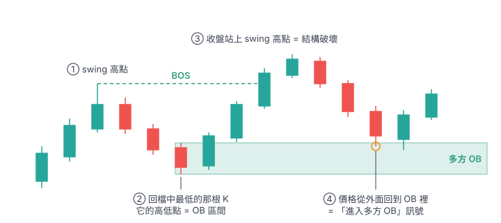

# 新手教學：SMC Order Block 與 TradingView 基礎

這份教學給第一次用 TradingView，或沒接觸過 SMC（Smart Money Concepts）的人。看完之後，你應該能自己把指標加到圖上，並看懂畫面上每個方框、標籤和面板在說什麼。

安裝與每日流程請看 [README](../README.md)，這裡只講觀念和操作。

- [第一部分：TradingView 基礎](#第一部分tradingview-基礎)
- [第二部分：SMC 與 Order Block 觀念](#第二部分smc-與-order-block-觀念)
- [第三部分：看懂本專案的指標](#第三部分看懂本專案的指標)
- [第四部分：一次完整的練習](#第四部分一次完整的練習)
- [名詞對照](#名詞對照)

---

## 第一部分：TradingView 基礎

### 1. 帳號與方案

到 [tradingview.com](https://tw.tradingview.com/) 註冊免費帳號就能使用本專案。免費方案每張圖可加的指標數、可建立的警報數都有上限，要同時掛很多份掃描器時才需要考慮付費方案。

### 2. 開圖、換商品、換週期

| 想做的事 | 操作 |
| --- | --- |
| 打開圖表 | 首頁上方選「產品 → 超級圖表」，或直接開 `tradingview.com/chart` |
| 換商品 | 點左上角的商品名稱，或在圖表上直接打字，輸入 `TWSE:2330`（上市）或 `TPEX:6488`（上櫃）後按 Enter |
| 換週期 | 點左上角的週期按鈕（例如「1小時」「日」），或在圖表上直接打 `60` 後按 Enter |

台股代號要加交易所前綴：上市是 `TWSE:`，上櫃是 `TPEX:`。

### 3. 移動與縮放圖表

| 想做的事 | 操作 |
| --- | --- |
| 左右移動 | 在圖表上按住滑鼠左鍵拖動 |
| 放大縮小（時間軸） | 滑鼠滾輪，或拖動下方的時間軸 |
| 拉高 / 壓扁 K 線（價格軸） | 在右側價格數字上按住上下拖 |
| 回到預設畫面 | 在價格軸按右鍵 →「重設價格坐標」（`Alt + R`） |
| 自動縮放 | 價格軸右下角的 `A`。亮著時會自動把 K 線塞滿畫面 |

> **圖表只能放大縮小、不能自由拖動？** 在右側價格軸按右鍵，取消勾選「**鎖定價格對K線比例**」。新帳號常遇到這個問題，跟指標無關。

### 4. 把 Pine 腳本加到圖表

本專案的腳本不在 TradingView 的公開指標庫裡，要自己貼上：

1. 點圖表下方的「**Pine 編輯器**」（Pine Editor）。
2. 點編輯器左上角的腳本名稱 →「建立新的」→「指標」。
3. 把編輯器裡的預設內容全部刪掉（`Ctrl + A` 再按 Delete），貼上 `.pine` 檔的完整內容。
4. 按「**儲存**」（`Ctrl + S`），取個名字。
5. 按「**新增到圖表**」（Add to chart）。

之後在同一個帳號，可以從上方的「指標」→「我的腳本」再次加入，不用重貼。

腳本更新之後，要把圖上舊的那份移除再重新加入，才會用到新版。

### 5. 調整、隱藏、移除指標

圖表左上角會列出目前加上的指標，滑鼠移過去會出現幾個小圖示：

| 圖示 | 作用 |
| --- | --- |
| 眼睛 | 暫時隱藏 |
| 齒輪 | 打開設定（參數、顏色、顯示項目） |
| ✕ 或垃圾桶 | 從圖上移除 |

### 6. 建立警報

1. 按右側工具列的鬧鐘圖示，或按 `Alt + A`。
2. 「條件」選你的指標名稱，例如「SMC OB Screener v5」。
3. 下方選「任何 alert() 函數呼叫」（Any alert() function call）。
4. 在「通知」分頁勾選要怎麼收到通知，例如手機 App 推播、電子郵件。
5. 按「建立」。

警報有到期時間，到期後要重新建立或延長。手機要收到推播，記得安裝 TradingView App 並登入同一個帳號。

### 7. 儲存圖表版面

右上角的「儲存」會把目前的商品、週期、指標和設定存成一個版面，下次打開還在。版面裡的指標設定（包含掃描器貼上的代號清單）也會一起保存。

---

## 第二部分：SMC 與 Order Block 觀念

SMC（Smart Money Concepts）是一套看盤方法，想法是：大資金進出時會在圖上留下痕跡，例如打破前高前低、在某個價位留下大量委託。SMC 沒有統一的標準定義，以下說明的是**本專案實際採用的規則**。

### 1. Swing 高點與低點

一段走勢裡明顯的轉折點。本專案的判定方式是：某根 K 棒的高點，比它之後 N 根 K 棒的最高價都高，就把它登記為 swing 高點；低點同理。

- **Internal**：N = 5，看短線的小轉折，訊號多、反應快。
- **Swing**：N = 50，看比較大的轉折，訊號少、層級高。

圖中的 ① 就是一個 swing 高點。

### 2. 結構破壞：BOS 與 CHoCH

**收盤價**站上最近一個還沒被突破的 swing 高點，就是「向上結構破壞」；收盤跌破 swing 低點，就是「向下結構破壞」。只有影線穿過不算。

依照破壞的方向和先前趨勢是否一致，分成兩種：

| 名稱 | 意思 | 例子 |
| --- | --- | --- |
| **BOS**（Break of Structure） | 順著原本的趨勢破壞，趨勢**延續** | 原本偏多，又往上突破前高 |
| **CHoCH**（Change of Character） | 跟原本的趨勢反向破壞，趨勢**可能反轉** | 原本偏空，卻往上突破前高 |

圖中的 ③ 是一次向上的結構破壞。

### 3. Order Block（OB）

結構破壞發生時，回頭看「swing 點到破壞前」這一段，找出其中**最低的那根 K**（向上破壞時）或**最高的那根 K**（向下破壞時），它的最高價到最低價就是 OB 區間。

- **多方 OB**：向上破壞產生，位在目前價格下方，一般視為潛在的支撐區。
- **空方 OB**：向下破壞產生，位在目前價格上方，一般視為潛在的壓力區。

直覺上，這根 K 是大資金發動那段走勢前「最後進場的地方」，價格日後回到這裡時，可能會再次遇到買盤或賣盤。

振幅特別大的 K 棒（超過 2 倍 ATR(200)）不會被選為 OB，避免一根爆量長 K 撐出一個過大的區間。

圖中的 ② 就是被選中的那根 K，淡綠色方框就是它產生的多方 OB。

### 4. 失效（Mitigation）

OB 被價格穿越後就失效，從圖上移除：

- 多方 OB：最低價跌破 OB 下緣就失效。
- 空方 OB：最高價突破 OB 上緣就失效。

設定裡可以把「失效判定」改成 `Close`，改成要收盤價穿越才算，OB 會留得比較久。

### 5. 進入 OB

價格**從 OB 外面**回到 OB 區間裡的那根 K 棒，就是「進入 OB」，也就是本專案警報在找的事件（圖中的 ④）。OB 剛成立的那根不算，已經在 OB 裡的也不會重複觸發。

「進入 OB」只代表價格來到一個值得注意的位置，**不是買賣訊號**。價格可能在這裡反彈，也可能直接穿過、讓 OB 失效。常見的做法是再搭配更大週期的趨勢方向、成交量或其他條件一起判斷。

---

## 第三部分：看懂本專案的指標

### 單一商品指標 `smc_order_blocks.pine`

加到圖上後會看到這些東西：

| 畫面上的東西 | 意思 |
| --- | --- |
| 綠色方框 | 多方 OB，從 OB 那根 K 往右延伸到最新一根 |
| 紅色方框 | 空方 OB |
| 方框右側的數字 `123.5 – 125.0` | OB 區間的下緣與上緣 |
| 虛線 + `BOS` / `CHoCH` 標籤 | 結構破壞：虛線畫在被突破的 swing 價位，從 swing 點畫到破壞那根 |
| 右上角面板 | 最近的多方 / 空方 OB 與目前狀態（見下表） |

預設只顯示最新 5 個還沒失效的 OB，可以在設定的「顯示數量」調整。

**狀態面板怎麼看**

| 欄位 | 內容 |
| --- | --- |
| 第一列 | 目前使用的結構層級（Internal 或 Swing） |
| 多方 / 空方：區間 | 離目前價格最近的那個 OB 的區間 |
| 多方 / 空方：距離 | `已進入`：價格正在 OB 裡；`1.2%`：還差多少才會碰到；`–`：目前沒有這個方向的 OB |
| 趨勢 | 最近一次結構破壞的方向：多、空，或還沒有破壞（–） |

### 多商品掃描器 `smc_ob_screener.pine`

掃描器把 40 檔股票的結果排成一張表，每一格的意思請看 [README 的「看表格」](../README.md#4-看表格)。用法上的重點：

1. 用掃描器找出「正在 OB 裡」或「快碰到 OB」的股票。
2. 把圖表切到那一檔、**同一個週期**，用單一商品指標看圖確認。

兩支腳本用的是同一套規則，但記住的 OB 數量不同，偶爾會有差異，詳見 README 的「已知問題」。

---

## 第四部分：一次完整的練習

用台積電練習一次，大約 10 分鐘：

1. 打開 TradingView 圖表，輸入 `TWSE:2330` 按 Enter，再輸入 `60` 按 Enter，切到 1 小時線。
2. 依照[第一部分第 4 節](#4-把-pine-腳本加到圖表)，把 `smc_order_blocks.pine` 加到圖表。
3. 找到圖上的綠色或紅色方框，往左看它的起點，那根 K 就是 OB 被選中的 K 棒。
4. 再往右找附近的 `BOS` 或 `CHoCH` 標籤，這就是讓這個 OB 成立的結構破壞。
5. 看右上角面板：現在離哪個 OB 最近？距離幾 %？
6. 往左拖動圖表，找一次價格回到方框裡的地方，觀察之後是反彈還是穿過（穿過的 OB 會消失）。
7. 打開齒輪設定，把「結構層級」改成 `Swing`，比較方框和標籤變少了多少。

熟悉之後，再照 [README 的快速開始](../README.md#快速開始)，用名單工具和掃描器跑每天的流程。

---

## 名詞對照

| 名詞 | 說明 |
| --- | --- |
| SMC | Smart Money Concepts，觀察大資金痕跡的看盤方法 |
| Swing 高點 / 低點 | 走勢中明顯的轉折點 |
| Internal / Swing | 本專案的兩種結構層級，分別看短線與長線轉折 |
| BOS | Break of Structure，順勢的結構破壞 |
| CHoCH | Change of Character，逆勢的結構破壞，可能是反轉 |
| OB | Order Block，結構破壞前最後一段反向走勢中的極值 K 棒區間 |
| Mitigation | OB 被價格穿越而失效 |
| ATR | Average True Range，平均真實波幅，用來衡量 K 棒振幅大小 |
| 週期 | 每根 K 棒代表的時間長度，例如 60 = 1 小時 |
| Pine Script | TradingView 的指標程式語言，`.pine` 檔就是 Pine 腳本 |

---

本教學只說明技術分析工具的用法，不構成投資建議。
